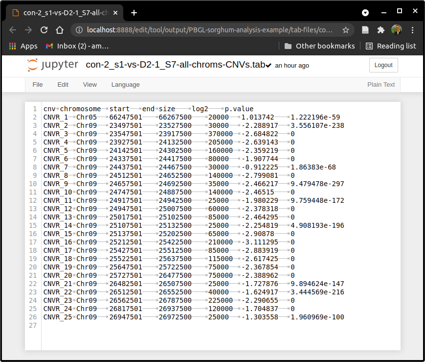

.. copy-number-analysis documentation master file, created by
   sphinx-quickstart on Mon Mar 15 14:55:47 2021.
   You can adapt this file completely to your liking, but it should at least
   contain the root `toctree` directive.

PBGL CNV-seq Analysis
=====================

.. toctree::
   :maxdepth: 4

Background
----------

Copy number variation (CNV) analysis using CNVseq, R, Jupyter Notebooks, Miniconda3, Mamba, and Git. 

All the commands run in a Linux terminal are preceded by the `$` prompt sign. To run a command, copy/past the command without the `$` sign. Those commands run in a Jupyter Notebook are preceded by the `In [ ]:` 

.. note::
   This is not an official IAEA publication but is made available as working material. The material has not undergone an official review by the IAEA. The views expressed do not necessarily reflect those of the International Atomic Energy Agency or its Member States and remain the responsibility of the contributors. The use of particular designations of countries or territories does not imply any judgement by the publisher, the IAEA, as to the legal status of such countries or territories, of their authorities and institutions or of the delimitation of their boundaries. The mention of names of specific companies or products (whether or not indicated as registered) does not imply any intention to infringe proprietary rights, nor should it be construed as an endorsement or recommendation on the part of the IAEA.

Installations - Virtual Environments and Software Packages
----------------------------------------------------------

Before installing any necessary software, it is recommended to check if the computer is running 32-bit or 64-bit for downloading Miniconda3. Run the following to verify the system:

::

   $ uname -m

Miniconda3 (conda) and Mamba
^^^^^^^^^^^^^^^^^^^^^^^^^^^^

Download the Miniconda3, or simply "conda", installer:
 
 - `Miniconda3 installer for Linux <https://docs.conda.io/en/latest/miniconda.html#linux-installers>`_

Run the downloaded installer (for a 64-bit system):

::

   $ bash Miniconda3-latest-Linux-x86_64.sh
   
Open a new terminal window for conda to take effect. The word `(base)` should appear in front of the computer name in the terminal window, like so:

.. figure:: ../images/terminal_base_env.png
   :alt: terminal-base
   :align: center
   
.. figure:: ../images/terminal_base_env_detail.png
   :alt: terminal-base-detail
   :align: center

Verify the installation and update conda in new terminal window with:

::

   $ conda env list
   $ conda update --all
   $ conda upgrade --all
   
Install mamba library/package manager that will be used for installing software dependencies of the tool:

::

   $ conda install mamba --yes
   
Git Installation and Repo Cloning
^^^^^^^^^^^^^^^^^^^^^^^^^^^^^^^^^

Git is required for cloning locally (downloading a copy to your local computer) the PBGL CNVseq Github repository. Git and Github are used for version control of software. It keeps track of development, releases, and issues of a software project.

Install **git** for cloning the **pbgl-cnvseq** software repository from Github, where the latetest version of the tool resides:

::

   $ mamba install git --yes
   
After the instalation, clone PBGL's CNVseq repository, **pbgl-cnvseq**, to the local computer in any desired directory.

::

   $ git clone https://github.com/pbgl/pbgl-cnvseq.git
   
The cloning process will depict the following:

::

   Cloning into 'pbgl-cnvseq'...
   remote: Enumerating objects: 628, done.
   remote: Counting objects: 100% (336/336), done.
   remote: Compressing objects: 100% (239/239), done.
   remote: Total 628 (delta 109), reused 292 (delta 78), pack-reused 292
   Receiving objects: 100% (628/628), 11.79 MiB | 7.03 MiB/s, done.
   Resolving deltas: 100% (190/190), done.
   
The **pbgl-cnvseq** repository should have been cloned successfully. Verify that the download is complete by listing the folders/files in the directory.

::

   $ ls -l
   
The folder called **pbgl-cnvseq** should be listed in the directory.

Required Libraries with Mamba
^^^^^^^^^^^^^^^^^^^^^^^^^^^^^

CNVseq has multiple dependencies, listed below:

- Samtools

- R

  - configr
  - ggplot2
  - BiocManager
  - Bioconductor-GenomicAlignments
  - Bioconductor-GenomeInfoDb
  
- Jupyter Notebook

  -  IRkernel

There are two ways to create the **cnvseq** virtual environment and install the necessary libraries to run CNVseq: automatically or manually.

Automatically (faster)
~~~~~~~~~~~~~~~~~~~~~~

One YAML file, **environment.yml**, is provided to automatically create a virtual environment and install the dependent libraries through mamba. The file creates the **cnvseq** virtual environment, along R, Jupyter Notebook, and the R-kernel in Jupyter. It also installs the dependent R libraries. Run **environment.yml**:

::

   $ mamba env create --file envs/environment.yml
   
Once done, a list of the virtual environments available can be seen by running:

::

   $ conda env list
   
Activate (enter) the recently-created virtual environment **cnvseq**:

::

   $ conda activate cnvseq
   
Once done, the virtual environment should be activated and all the necessary packages should be installed. This can be verified with:

::

   $ conda list

Manually (slower)
~~~~~~~~~~~~~~~~~

To manually create and activate an environment, run:

::

   $ conda create --name cnvseq
   $ conda activate cnvseq 
   
Start running the installations of the necessary libraries:

::

   $ mamba install --channel conda-forge notebook r-irkernel r-biocmanager --yes
   $ mamba install --channel bioconda samtools bioconductor-genomicalignments bioconductor-genomeinfodb --yes
   $ mamba install --channel r r-ggplot2 --yes
   $ mamba install --channel pcgr r-configr --yes
   
Once done, all the necessary packages should be installed. This can be verified with:

::

   $ conda list
   
Running Jupyter
---------------

To activate Jupyter, run the following in the terminal:

::

   $ jupyter notebook
   
This command will start a Jupyter session inside the directory the command is run. The user can navigate between directories, visualize files, and edit files in a web browser by clicking on directories or files, respectively.  

Look for the directory **pbgl-cnvseq** and click on it. Click on **tool** directory, which contains three directories and two Jupyter Notebooks. Here is a breakdown of each:

- `config`:
  
  - directory containing configuration files specifying file paths, parameter definitions, and comparison lists

- `helper-functions`:

  - directory containing R scripts with functions to calculate and plot CNVs
  
- `output`:

  - directory that will contain both tab-files and images output after running a CNVseq analysis
    
- two Jupyter Notebooks:

  - RCNV-seq-PBGL-sorghum-analysis-example.ipynb
  
    - example analysis of a comparison between a control and mutant of sorghum 
    
  - RCNV-seq-template.ipynb
    
    - template for the user
    
.. note::
   Jupyter lets the user duplicate, rename, move, download, view, or edit files in a web browser. This can be done by clicking the box next to a file and choosing accordingly. 
   
Editing the Configuration File
^^^^^^^^^^^^^^^^^^^^^^^^^^^^^^

In order to run the CNVseq Jupyter Notebook, the user needs to feed it with a configuration file (**config-CNVseq.yml**) that specifies the paths to the bam files, comparisons to be done, chromosomes to analyze, and parameter definitions for calculating and plotting CNVs.

The configuration file **config-CNVseq.yml** can be found in the **pbgl-cnvseq/tool/config** directory. The configuration file contains the following:

::

    # parameters for CNV/window size calculations defaults from HLiang:
    # https://github.com/hliang/cnv-seq
    parameters:
      annotate: TRUE
      bed_file_present: FALSE
      bigger: 1.5
      log2: 0.6
      pvalue: 0.001
      window_size: 10000

    # list of chromosomes to be analyzed
    chromosomes: 
      - Chromosome1 
      - Chromosome2 
      - Chromosome3     
      - AnotherChromosome

    # folder to store outputs; should be inside "output" directory, example:
    # output_path: output/run-name or output/organism
    output_path: output/organism-being-analyzed

    # path to bed file for varying window sizes (optional)
    bed_path: /path/to/bed/file.bed

    # paths to bam files
    paths:
      control-1: &control-1 /path/to/bam/file/control-1.bam
      mutant-1: &mutant-1 /path/to/bam/file/mutant-1.bam
      mutant-2: &mutant-2 /path/to/bam/file/mutant-2.bam

    # comparisons to be analyzed
    comparisons:
      control-1-vs-mutant-1:
        control: *control-1
        mutant: *mutant-1
      control-1-vs-mutant-2:
        control: *control-1
        mutant: *mutant-2

.. note::
   The user needs to edit **config-CNVseq.yml** to point towards bam/bed files; specify comparisons and chromosomes to analyze; and define the parameters to calculate/plot CNVs.  

One example configuration files is provided (**config-CNVseq-PBGL-sorghum-analysis-example.yml**). The configuration file **config-CNVseq.yml** contains multiple fields to be defined by the user. 

- `parameters`:

  - parameters used to create window sizes, thresholds, plots, etc
  - the parameter defaults are provided accroding to HLiang's original values

- `chromosomes`: 

  - list of chromosome names to analyze
  - chromosome names can be found in a bam file's header using the following samtools command:
    
::

   $ samtools view -h my_bam_file.bam | less -S
    
- `output_path`:

  - directory that will contain both tab-files and images output after running a CNVseq analysis
  - the defined path will be inside the **pbgl-cnvseq/tool/output** directory
  - `images`:
  
    - directory that will store the CNV image outputs per comparison of:
    - all chromosomes in one plot
    - each chromosome individually in one plot
    - any zoomed-in region plot of one chromosome
  
  - `tab-files`:

    - directory that will contain two types of output tab-delimited files:
  
      - hits used to calculate CNVs, containing chromosome, start, end, width, control coverage, mutant coverage
      - CNVs per chromosome per comparison, containing CNV number, chromosome, start, end, size, log2, and p-value
      
- `bed_path`:

  - path pointing to bed file containing targets if using varying window sizes
  - it is recommended to run the analysis without a **.bed** file; plots will only reflect the targets in a **.bed** file
  - if a **.bed** file is provided, the `bed_file_present` parameter under the `parameters` section has to be changed to `TRUE`

- `paths`:

  - sample names and their respective paths to **.bam** files
  - samples can be named as desired but the sample name must be repeated after the colon and prefixed with a `&` sign
  - the `&` prefix sign is used to reference the sample's path in different places of the same configuration file
  - example use:
  
::

   paths:
     mysample: &mysample /home/username/bam_files/mysample.bam
     XYZ-123: &XYZ-123 /home/username/bam_files/XYZ-123.bam
     potato95: &potato95 /home/username/bam_files/potato95.bam 
  
- `comparisons`: 

  - comparison names with respective control and mutant samples per comparison
  - each comparison can be named as desired
  - the sample names to be used as `control` and `mutant` need to be prefixed by a `*` sign
  - the `*` prefixed sign is used to extract the sample's path defined in the `paths` section
  - example:

::

   comparisons:
     comparison-1:
       control: *mysample
       mutant: *potato95
     a-different-comparison-278asd:
       control: *mysample
       mutant: *XYZ-123

Running a RCNV_seq-template Jupyter Notebook
^^^^^^^^^^^^^^^^^^^^^^^^^^^^^^^^^^^^^^^^^^^^

.. note::
   It is recommended to duplicate the **RCNV-seq-template** notebook and then renaming the copy before doing any edits to the notebook.

In the **pbgl-cvnseq/tool** directory, click on **RCNV-seq-template** and a new tab in your web-browser will open the notebook.

The notebook contains cells that are populated by text or code. Instructions are provided in the notebook to guide the user. To run a cell, click on the corresponding cell and click on the `Run` button on the top of the notebook. Another way to run a cell can be done by clicking on the corresponding cell and pressing **Ctrl + Enter** or **Shift + Enter**.

The notebook consists of 6 sections:

1. Installing Required Libraries (optional)
2. Loading Required Libraries (mandatory)
3. User Input (mandatory)
4. CNV Calculations
5. Plotting
6. Plotting a Zoomed-In Region of One Chromosome

Installing Required Libraries (optional)
~~~~~~~~~~~~~~~~~~~~~~~~~~~~~~~~~~~~~~~~

- libraries being installed: 

::

    In [ ]: # install necessary libraries using R functions
            if (!requireNamespace("BiocManager", quietly = TRUE))
                install.packages("BiocManager")

            BiocManager::install(c("GenomicAlignments", "GenomeInfoDb"))
            install.packages("configr")
            install.packages("ggplot2")

- to be run if the mamba installations were not successful or the loading of the required libraries fails under the **Loading Required Libraries** section

Loading Required Libraries (mandatory)
~~~~~~~~~~~~~~~~~~~~~~~~~~~~~~~~~~~~~~

- libraries being loaded:

::

   In [ ]: # load necessary libraries
           library(GenomicAlignments)
           library(ggplot2)
           library(configr)

           # specify source R script with helper functions
           source("helper-functions/RCNV_seq-helper.R")
           source("helper-functions/cnvHLiang.R")

- this cell will load necessary libraries and scripts containing the necessary functions to be used
- if running this cell fails, some libraries may be missing from the installation
  
  - to fix this issue, run the installations under the **Installing Required Libraries**

User Input (mandatory)
~~~~~~~~~~~~~~~~~~~~~~

- the user needs to write the appropriate name of the configuration file being used in the following cell:
  
:: 

   In [ ]: configPath <- "config/config-CNVseq.yml"
   
- the bottom cell will extract the fields defined in the configuration file:

::

   In [ ]: config <- read.config(configPath)

CNV Calculations
~~~~~~~~~~~~~~~~

- function to calculate all the hits and CNVs:

::

   In [ ]: cnvCalculate(config)

- output tabulated files are stored inside **pbgl-cnvseq/tool/output/name_defined_in_output_path_of_config/tab-files** directory

Plotting
~~~~~~~~

- function to plot two types of images:
  
  1. CNVs of all chromosomes in the same plot
  2. CNVs of one chromosome per plot

::

   In [ ]: cnvPlot(config, imgType="", yMin= , yMax= )
  
- function parameters are:

  - `config` - configuration file defined under **User Input** section
  - `imgType` -  image extention to use; available options are: `png`, `jpeg`, `svg`, and `pdf`; default to `png`
  - `yMin` - y-axis bottom limit; default to `-5`
  - `yMax` - y-axis upper limit; default to `5`
    
- output images are stored inside the **pbgl-cnvseq/tool/output/name_defined_in_output_path_of_config/images** directory
- it is recommended to inspect the CNV-plots with default y-limits and then modify
- `cnvPlotting` can be used in two ways: with default values or user-defined values

  - with default values, the parameters can be omitted and set to `imgType="png"`, `yMin=-5` and `yMax=5`
  - the following two commands have the same parameter values and will output the same plots:
    
::

   In [ ]: cnvPlot(config)
           cnvPlot(config, imgType="png", yMin=-5, yMax=5)

Plotting a Zoomed-In Region of One Chromosome
~~~~~~~~~~~~~~~~~~~~~~~~~~~~~~~~~~~~~~~~~~~~~

- function to plot a specific zoomed-in region of one chromosome

::

   In [ ]: cnvPlotZoom(config, tabFile, chromosome="", start= , end= , yMin= , yMax= , imgType="")

- function parameters are:

  - `config` - configuration file defined under **User Input** section
  - `tabFile` -  tabulated file containing all hits; requires user-input to define path to all-hits tabulated file
  - `chromosome` - chromosome name to focus on; default to `NA`
  - `start` - start of window in bp; both scientific notation is accepted: `100000` or `10e4`; defaults to `NA`
  - `end` - end of window in bp; the same applies as in the `start` parameter; defaults to NA
  - `yMin` - y-axis bottom limit; default to `-5`
  - `yMax` - y-axis upper limit; default to `5`
  - `imgType` -  image extention to use; available options are: `png`, `jpeg`, `svg`, and `pdf`; defaults to `png`
  
- requires path definition of `tabFile` parameter in the cell:

::

   In [ ]: tabFile <- "output/run-name/tab-files/tab-file.tab"

Example Tutorial - CNV Analysis of Sorghum
------------------------------------------

In this section of the manual, an example analysis of sorghum will be shown in a step-by-step process. The data has been subset to three chromosomes Chr04, Chr05, and Chr09. The CNVseq analysis will depict a deletion on chromosome Chr09.

The tutorial is divided between the following sections:

1. Data Download
2. General Installations
3. Github Repository Cloning
4. Virtual Environment Creation
5. Configuration File Editing
6. Jupyter Notebook Analysis

Data Download
^^^^^^^^^^^^^

Running this tutorial requires two binary alignment map (BAM) files of sorghum crop: one control and one mutant. Each **.bam** file is subset for chromosomes Chr04, Chr05, and Chr09; this is reflected on their names. They have been both sorted and indexed using samtools. 

The following links can be used to download the necessary **.bam** and **.bam.bai** (index) files:

- con-2_S1 (sorghum control)

  - https://bss1innov1nafa1poc1.blob.core.windows.net/sample-container/2021_Training/con-2_S1-Chromes-04-05-09.bam
  - https://bss1innov1nafa1poc1.blob.core.windows.net/sample-container/2021_Training/con-2_S1-Chromes-04-05-09.bam.bai
  
- D2-1_S7 (sorghum mutant)

  - https://bss1innov1nafa1poc1.blob.core.windows.net/sample-container/2021_Training/D2-1_S7-Chromes-04-05-09.bam
  - https://bss1innov1nafa1poc1.blob.core.windows.net/sample-container/2021_Training/D2-1_S7-Chromes-04-05-09.bam.bai

There are two additional ways to download the **.bam** files and their respectives indices, besides clicking the links above:

1. Linux terminal
2. Web-Browser

Linux Terminal
~~~~~~~~~~~~~~

Open a new terminal and navigate to a directory of choice. We recommend creating a directory to store the data and running `wget` in the respective location:

:: 

   $ mkdir bam_files
   $ cd bam_files
   $ wget https://bss1innov1nafa1poc1.blob.core.windows.net/sample-container/2021_Training/con-2_S1-Chromes-04-05-09.bam
   $ wget https://bss1innov1nafa1poc1.blob.core.windows.net/sample-container/2021_Training/con-2_S1-Chromes-04-05-09.bam.bai
   $ wget https://bss1innov1nafa1poc1.blob.core.windows.net/sample-container/2021_Training/D2-1_S7-Chromes-04-05-09.bam
   $ wget https://bss1innov1nafa1poc1.blob.core.windows.net/sample-container/2021_Training/D2-1_S7-Chromes-04-05-09.bam.bai

Web-Browser
~~~~~~~~~~~

Open a web-browser of preference. Copy/paste the links provided above in the address bar. This should automatically begin the download. Move the downloaded files to a location of personal preference.

General Installations
^^^^^^^^^^^^^^^^^^^^^

Open a web browser and copy/paste the following link to download Miniconda3:

- https://docs.conda.io/en/latest/miniconda.html#linux-installers

After download, open a new terminal window, navigate to the directory with the downloaded Miniconda3 installer, and run the installation.

.. note::
   The donwloaded Miniconda3 installer file might not match the one run in this example. Please, type the corresponding name of the **.sh** file downloaded.

::

   $ bash Miniconda3-latest-Linux-x86_64.sh

Once the Miniconda3 installation is done, close the terminal and open a new one. The word `(base)` should be present to the left of the computer name in the prompt. Update conda and install mamba.

::

   $ conda update --all --yes
   $ conda upgrade --all --yes
   $ conda install mamba --yes

Github Repository Cloning
^^^^^^^^^^^^^^^^^^^^^^^^^

Git or Github is used for storage and version control of software projects. Git is used to manage in a local Linux terminal. First, git will need to be installed. In a new terminal window, run the installation command:

::

   $ mamba install git --yes

After installing git, create a location to store Github repoitories, navigate into it, and clone (download a copy locally) of PBGL's **pbgl-cnvseq** repository.

::

   $ mkdir Github
   $ cd Github
   $ git clone https://github.com/pbgl/pbgl-cnvseq
   
A successful cloning will output the following:

::

   Cloning into 'pbgl-cnvseq'...
   remote: Enumerating objects: 628, done.
   remote: Counting objects: 100% (336/336), done.
   remote: Compressing objects: 100% (239/239), done.
   remote: Total 628 (delta 109), reused 292 (delta 78), pack-reused 292
   Receiving objects: 100% (628/628), 11.79 MiB | 7.03 MiB/s, done.
   Resolving deltas: 100% (190/190), done.

Navigate into the cloned repository,

::

   $ cd pbgl-cnvseq
   
Virtual Environment Creation
^^^^^^^^^^^^^^^^^^^^^^^^^^^^

Once inside the **pbgl-cnvseq** directory, create the **cnvseq** virtual environment, install the necessary libraries, and activate the newly created **cnvseq** virtual environment. 

::

   $ mamba env create --file envs/environment.yml
   $ conda activate cnvseq

The name `(cnvseq)` environment should be reflected to the left of the computer name in the terminal command prompt.

Configuration File Editing
^^^^^^^^^^^^^^^^^^^^^^^^^^

Open a Jupyter session by running,

::

   $ jupyter notebook

Navigate to **pbgl-cnvseq/tool/config** and click on **config-CNVseq-PBGL-sorghum-analysis-example.yml**. This will open the configuration file in a new web-browser tab. Copy/paste the following in the configuration file.

.. note::
   The paths to the bam files will not match. They need to be edited accordingly to point towards the location of the bam files stored locally in the user's computer.
   
::

    # parameters for CNV/window size calculations defaults from HLiang:
    # https://github.com/hliang/cnv-seq
    parameters:
      annotate: TRUE
      bed_file_present: FALSE
      bigger: 1.5
      log2: 0.6
      pvalue: 0.001
      window_size: 10000

    # list of chromosomes to be analyzed
    chromosomes: 
      - Chr04
      - Chr05
      - Chr09

    # folder to store outputs; should be inside "output" directory, example:
    # output_path: output/run-name or output/organism
    output_path: output/PBGL-sorghum-analysis-example

    # path to bed file for varying window sizes (optional)
    bed_path: 

    # paths to bam files
    paths:
      con-2_S1: &con-2_S1 /home/anibal/bam_files/sorghum/con-2_S1-Chromes-04-05-09.bam
      D2-1_S7: &D2-1_S7 /home/anibal/bam_files/sorghum/D2-1_S7-Chromes-04-05-09.bam

    # comparisons to be analyzed
    comparisons:
      con-2_s1-vs-D2-1_S7:
        control: *con-2_S1
        mutant: *D2-1_S7
        
Save the file and close the tab.

Jupyter Notebook Analysis
^^^^^^^^^^^^^^^^^^^^^^^^^

In the open Jupyter session, navigate to the **pbgl-cnvseq/tool** directory and click on the **RCNV-seq-template.ipynb** Jupyter Notebook. Begin by running the **Loading Required Libraries** section. This can be done by clicking on the cell to be run followed by clicking the `Run` button on the top of the Jupyter Notebook.

::

   In [ ]:  # load necessary libraries
            library(GenomicAlignments)
            library(ggplot2)
            library(configr)

            # specify source R script with helper functions
            source("helper-functions/RCNV_seq-helper.R")
            source("helper-functions/cnvHLiang.R")

If loading the libraries is unsuccessful (specified in the cell output), an attempt to install the missing libraries can be done by running the **Installing Required Libraries** section, 

::

   In [ ]:  # install necessary libraries using R functions
            if (!requireNamespace("BiocManager", quietly = TRUE))
                install.packages("BiocManager")

            BiocManager::install(c("GenomicAlignments", "GenomeInfoDb"))
            install.packages("configr")
            install.packages("ggplot2")

Run the **User Input** section after correctly editing the name/path of the configuration file:

::

   In [ ]: configPath <- "config/config-CNVseq-PBGL-sorghum-analysis-example.yml"
   
Load the contents of the configuration file by running the cell,

::

   In [ ]: config <- read.config(configPath)

Copy number variants (CNVs) are calculated under the **CNV Calculations** section by running the cell,

::

   In [ ]: cnvCalculate(config)
   
The output tabulated files of all-hits and CNVs can be inspected in the **pbgl-cnvseq/tool/output/PBGL-sorghum-analysis-example/tab-files** directory. These can be used to import data to other softwares of choice for downstream data analysis. A successful run has the following output right under the input cell,

::

    Comparison: con-2_s1-vs-D2-1_S7
    Comparing samples:
    /home/anibal/bam_files/sorghum/con-2_S1-Chromes-04-05-09.bam 
    vs.
     /home/anibal/bam_files/sorghum/D2-1_S7-Chromes-04-05-09.bam 

    [1] "chromosome:  Chr04"
    [1] "chromosome:  Chr05"
    [1] "chromosome:  Chr09"
    [1] "cnv_id:  1  of  25"
    [1] "cnv_id:  2  of  25"
    [1] "cnv_id:  3  of  25"
    [1] "cnv_id:  4  of  25"
    [1] "cnv_id:  5  of  25"
    [1] "cnv_id:  6  of  25"
    [1] "cnv_id:  7  of  25"
    [1] "cnv_id:  8  of  25"
    [1] "cnv_id:  9  of  25"
    [1] "cnv_id:  10  of  25"
    [1] "cnv_id:  11  of  25"
    [1] "cnv_id:  12  of  25"
    [1] "cnv_id:  13  of  25"
    [1] "cnv_id:  14  of  25"
    [1] "cnv_id:  15  of  25"
    [1] "cnv_id:  16  of  25"
    [1] "cnv_id:  17  of  25"
    [1] "cnv_id:  18  of  25"
    [1] "cnv_id:  19  of  25"
    [1] "cnv_id:  20  of  25"
    [1] "cnv_id:  21  of  25"
    [1] "cnv_id:  22  of  25"
    [1] "cnv_id:  23  of  25"
    [1] "cnv_id:  24  of  25"
    [1] "cnv_id:  25  of  25"

    CNV percentage in genome: 1.6%
    CNV nucleotide content: 3140000
    CNV count: 25
    Mean size: 125600
    Median size: 85000
    Max Size: 750000
    Min Size: 20000

    cnv	chromosome	start	end	size	log2	p.value
    CNVR_1	Chr05	66247501	66267500	20000	1.013742	1.222196e-59
    CNVR_2	Chr09	23497501	23527500	30000	-2.288917	3.556107e-238
    CNVR_3	Chr09	23547501	23917500	370000	-2.684822	0
    CNVR_4	Chr09	23927501	24132500	205000	-2.639143	0
    CNVR_5	Chr09	24142501	24302500	160000	-2.359219	0
    CNVR_6	Chr09	24337501	24417500	80000	-1.907744	0
    CNVR_7	Chr09	24437501	24467500	30000	-0.912225	1.86383e-68
    CNVR_8	Chr09	24512501	24652500	140000	-2.799081	0
    CNVR_9	Chr09	24657501	24692500	35000	-2.466217	9.479478e-297
    CNVR_10	Chr09	24747501	24887500	140000	-2.46515	0
    CNVR_11	Chr09	24917501	24942500	25000	-1.980229	9.759448e-172
    CNVR_12	Chr09	24947501	25007500	60000	-2.378318	0
    CNVR_13	Chr09	25017501	25102500	85000	-2.464295	0
    CNVR_14	Chr09	25107501	25132500	25000	-2.254819	4.908193e-196
    CNVR_15	Chr09	25137501	25202500	65000	-2.90878	0
    CNVR_16	Chr09	25212501	25422500	210000	-3.111295	0
    CNVR_17	Chr09	25427501	25512500	85000	-2.883919	0
    CNVR_18	Chr09	25522501	25637500	115000	-2.617425	0
    CNVR_19	Chr09	25647501	25722500	75000	-2.367854	0
    CNVR_20	Chr09	25727501	26477500	750000	-2.388962	0
    CNVR_21	Chr09	26482501	26507500	25000	-1.727876	9.894624e-147
    CNVR_22	Chr09	26512501	26552500	40000	-1.624917	3.444569e-216
    CNVR_23	Chr09	26562501	26787500	225000	-2.290655	0
    CNVR_24	Chr09	26817501	26937500	120000	-1.704837	0
    CNVR_25	Chr09	26947501	26972500	25000	-1.303558	1.960969e-100
   
The output tabulated files under **pbgl-cnvseq/tool/output/PBGL-sorghum-analysis-example/tab-files** are the following:

- con-2_s1-vs-D2-1_S7-all-chroms-CNVs.tab
- con-2_s1-vs-D2-1_S7-window-10000-all-hits.tab

A depiction of the files are shown below,

.. figure:: ../images/all-hits-tab-file.png
   :alt: all-hits-tab
   :align: center

   Tabulated file containing all hits of all chromosomes

   Tabulated file containing all CNVs of all chromsomes

After the CNV calculations are done, plot the CNVs under the **Plotting** section. Here, the parameters will be set to the following,

::

   In [ ]: cnvPlot(confg, imgType="png", yMin=-5, yMax=5)
   
The output images under **pbgl-cnvseq/tool/output/PBGL-sorghum-analysis-example/images** are the following:

- con-2_s1-vs-D2-1_S7-chromosome-all-window-10000.png
- con-2_s1-vs-D2-1_S7-chromosome-Chr04-window-10000.png
- con-2_s1-vs-D2-1_S7-chromosome-Chr05-window-10000.png
- con-2_s1-vs-D2-1_S7-chromosome-Chr09-window-10000.png
   
The output plots are the following,

.. figure:: ../images/con-2_s1-vs-D2-1_S7-chromosome-all-window-10000.png
   :alt: cnv-all-chroms
   :align: center
   
   CNV plot of all chromosomes  

.. figure:: ../images/con-2_s1-vs-D2-1_S7-chromosome-Chr04-window-10000.png
   :alt: cnv-chrom-04
   :align: center
   
   CNV plot of chromosome Chr04

.. figure:: ../images/con-2_s1-vs-D2-1_S7-chromosome-Chr05-window-10000.png
   :alt: cnv-chrom-05
   :align: center
   
   CNV plot of chromosome Chr05
   
.. figure:: ../images/con-2_s1-vs-D2-1_S7-chromosome-Chr09-window-10000.png
   :alt: cnv-chrom-09
   :align: center
   
   CNV plot of chromosome Chr09

As seen above, each plot contains:

- a title of the chromosome being analyzed
- a sub-title of the comparison being done
- Log2 Ratio in the y-axis
- chromosome name on the x-axis in plot of all chromosomes
- base-pair (bp) position on the x-axis in plot of one chromosome
- a label under the x-axis specifying the location of the stored image

The CNV plot of chromosome Chr09 shows an artifact. Moreover, this artifact seems to lie between base-pairs 2e07 and 3e07. To zoom in, the **Plotting a Zoomed-In Region of One Chromosome** section is provided. 

Under the **Plotting a Zoomed-In Region of One Chromosome** section, first specify the location of the all-hits tabulated file of chromosome Chr09,

::

   In [ ]: tabFile <- "output/PBGL-sorghum-analysis-example/tab-files/con-2_s1-vs-D2-1_S7-window-10000-all-hits.tab"
   
The run the zooming-in function with the following parameters,

::

   In [ ]: cnvPlotZoom(config, tabFile, chromosome="Chr09", start=2.3e7 , end=2.8e7 , yMin=-5 , yMax=2.5, imgType="png")
   
The output plot, which is also stored in the **pbgl-cnvseq/tool/output/PBGL-sorghum-analysis-example/images**, shows a zoomed-in region of chromosome Chr09 of sorghum. The output path is also specified under the x-axis label. 

.. figure:: ../images/con-2_s1-vs-D2-1_S7-window-10000-chromosome-Chr09-zoomed.png
   :alt: cnv-chrom-09-zoom
   :align: center
   
   CNV plot of a zoomed-in region of chromosome Chr09

Knowing where artifacts like this one is located plays a major role in identifying insertions or deletions in an organism. The user can, in turn, use different tools, like the Integrative Genomics Viewer (IGV), for further analysis.

This culminates the tutorial.

References
----------

**BMC Bioinformatics Publication**:

- `CNV-seq, a new method to detect copy number variation using high-throughput sequencing <https://bmcbioinformatics.biomedcentral.com/articles/10.1186/1471-2105-10-80>`_

**GitHub repositories**:

- `hliang/cnv-seq <https://github.com/hliang/cnv-seq>`_
- `Bioconductor/copy-number-analysis <https://github.com/Bioconductor/copy-number-analysis/wiki/CNV-seq>`_
- `pbgl/pbgl-cnvseq <https://github.com/pbgl/pbgl-cnvseq>`_
- `amora197/pbgl-cnvseq <https://github.com/amora197/pbgl-cnvseq>`_
